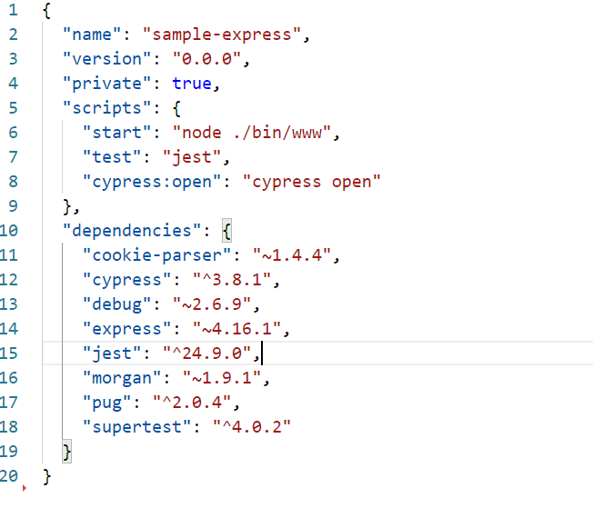
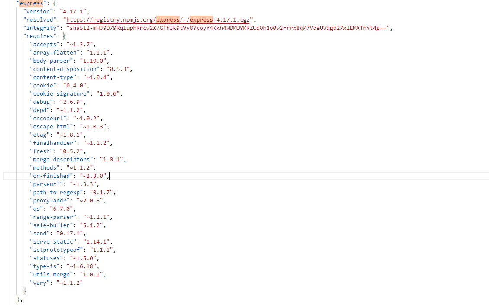

# NPM

## What is npm?
1. Node Package Manager
2. Open-source developers use npm to share software.
3. npm is installed with Node.js

## Install npm
1. npm is installed with Node.js(You have to install Node.js to get npm installed on your computer)
2. All npm packages are defined in files called package.json.
3. The content of package.json must be written in JSON.(name and version are the minimun two fields )

## package.json and package-lock.json
1. The package.json 
    - used for more than dependencies -     like defining project properties, description, author & license information, scripts, etc. 
    - records the minimum version you app needs. If you update the versions of a particular package, the change is not going to be reflected here.
2. The package-lock.json is solely used to lock dependencies to a specific version number.
    - Introduced in npm v5, the purpose of this file is to ensure that the dependencies remain the same on all machines the project is installed on. 
    - It is automatically generated for any operations where npm modifies either the node_modules folder, or package.json file.
    - records the exact version of each installed package which allows you to re-install them. Future installs will be able to build an identical dependency tree.

<i>Summary - package-lock</i>
* large list of each dependency listed in your package.json
* the specific version that should be installed
* the location of the module (URI)
* a hash that verifies the integrity of the module
* the list of packages it requires
* a list of dependencies.

<i>Question arises</i>
- <i>Do you need both package-lock.json and package.json?</i> <b>No.</b>
- <i>Do you need the package.json? </i> <b>Yes.  </b>
- <i>Can you have a project with only the package-lock.json? </i> <b>No.</b>

   

## npm commmands
* npm config
    * npm config list (gives information about install)

1. npm --version // gives the version of npm installed
2. npm init // Initializes a node 
3. npm install  
    1. No options -- Install the dependencies in the local node_modules folder.
    2. In global mode (ie, with -g or --global appended to the command), it installs the current package context (ie, the current working directory) as a global package.
    3. With the --production flag (or when the NODE_ENV environment variable is set to production), npm will not install modules listed in devDependencies.
    4. --save-dev installs all the dev dependancies only.
4. npm list --global (lists the global packages)
  ### Upgrade to latest npm version
    npm install -g npm@latest       (installs the latest npm version)
    npm install -g npm@next         (installs the recent release)
5. npm uninstall 
6. npm install vibraniumbrigade@1.0.0 (installs the specific version)
7. npm search vibraniumbrigade (searches for the package)

## Cache
* When npm installs a package it keeps a copy, so the next time you want to install that package, it doesn’t need to hit the network. 
* npm-cache
* npm cache clean --force (needs to be cleaned occasionally)

## Audit
npm audit
npm audit fix

## How a npm install actually works? What happens?
* Load the existing node_modules tree from disk
* clone the tree
* fetch the package.json and assorted metadata and add it to the clone
* walk the clone and add any missing dependencies
   1. dependencies will be added as close to the top as is possible without breaking any other modules
* compare the original tree with the cloned tree and make a list of
* actions to take to convert one to the other
* execute all of the actions, deepest first
    1. kinds of actions are install, update, remove and move

## Limitations 
* npm will refuse to install any package with an identical name to the current package. This can be overridden with the --force flag, but in most cases can simply be addressed by changing the local package name.

For more info, https://docs.npmjs.com/cli/install

# Lets create a node js application

Node js consists of below:
* <b><i>Import required modules </i></b>− We use the require directive to load Node.js modules.
* <b><i>Create server </i></b>− A server which will listen to client's requests similar to Apache HTTP Server.
* <b><i>Read request and return response </i></b>− The server created in an earlier step will read the HTTP request made by the client which can be a browser or a console and return the response.

# Demo

# Node REPL (Read Eval Print Loop)

<b>Read</b> <i> Reads user input, parses the input  into JS datastructure and stores in memory</i>
--

<b>Eval</b>     <i>Takes and evaluates the data structure</i>
<b>Print</b>    <i>prints the result</i>
<b>Loop</b>     <i>Loops the above command until user presses Ctrl+C</i>

# Demo

